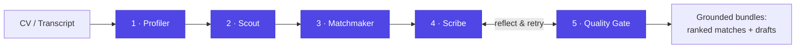
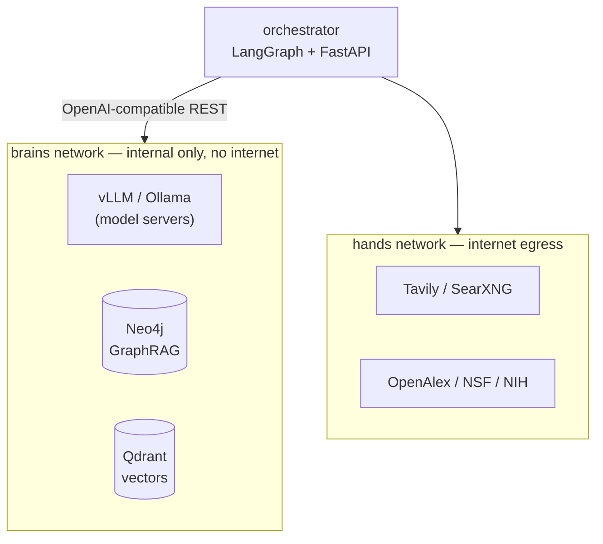

# scholar-agent

**An autonomous research partner for scholarship & PhD applicants.**
Give it your CV — it searches the live web for funded scholarships, PhD, and
Master's positions, ranks them against your actual profile, and drafts
**grounded** (fact-checked, non-hallucinated) cold emails and Statements of
Purpose for your best matches.

[](https://github.com/MehrajRahman/scholar-agent/actions/workflows/test.yml)
[](LICENSE)
[](pyproject.toml)

> 📖 **New here?** [docs/PROJECT_OVERVIEW.md](docs/PROJECT_OVERVIEW.md) walks
> through one CV flowing end-to-end through every agent. [SKILLS/skills.md](SKILLS/skills.md)
> is the original architecture design doc this build follows.

---

## Why this exists

Finding funded opportunities abroad means grinding through dozens of
university portals, professor pages, and scholarship boards by hand, then
writing a tailored email and SOP for each one. This automates the grind
without automating the judgment: every match is scored with real signals
(not vibes), every generated claim is checked against your CV and the
professor's actual public record, and nothing is ever sent without your
review.

## Features

- 🔎 **Deep research agent** — plans search queries, crawls the live web
  (Tavily server-rendered content, ranked by relevance + source reputation),
  and extracts structured opportunities — not just a list of links.
- 🧠 **GraphRAG matchmaking** — fuses dense + BM25 hybrid retrieval,
  cross-encoder reranking, and Neo4j graph-proximity scoring with an LLM
  judgment call into one calibrated 0–100 score.
- ✍️ **Grounded drafting** — a Scribe/Quality-Gate reflection loop writes a
  cold email + SOP, decomposes them into atomic claims, and rewrites until
  every claim is backed by evidence (or the retry budget runs out).
- 📄 **Layout-aware CV parsing** — multi-column academic CVs are read in the
  correct column order, not scrambled left-to-right.
- 🌐 **Web UI** — live progress while it works, source links + funding/
  deadline/university on every result, and on-demand "generate email + SOP"
  for any match without re-running the whole pipeline.
- 🔌 **Provider-agnostic brains** — Ollama, Groq, OpenRouter, Cerebras, or any
  OpenAI-compatible endpoint, with automatic failover between them.
- 🧪 **Actually tested** — 48 offline unit tests plus a live health-check
  (`make check`) that verifies every runtime dependency before you run it.

---

## How it works



| Agent | Role | Output |
|---|---|---|
| **1. Profiler** | Parses messy CV/transcript text into a structured profile | `StudentProfile` |
| **2. Scout** | Plans queries, searches + crawls the live web, extracts opportunities | `Opportunity[]` |
| **3. Matchmaker** | Fuses semantic + graph + eligibility signals into a calibrated score | `MatchResult[]` |
| **4. Scribe** | Drafts a cold email + SOP grounded in your profile and the real record | `SynthesisBundle` |
| **5. Quality Gate** | Audits every claim; rejects with feedback until grounded | `GroundednessReport` |

Each agent is a pure `async (state) -> partial_state` LangGraph node in
[src/scholar/agents/](src/scholar/agents/). The full state machine — including
the bounded Scribe⇄Quality-Gate reflection loop and the shortlist map — is
wired in [src/scholar/graph_app.py](src/scholar/graph_app.py).

### Matching signals

Ranking an opportunity is not a single similarity score — it's four
independent signals fused together:

1. **Semantic** — dense (bge) + BM25 hybrid retrieval, fused with Reciprocal
   Rank Fusion, then re-scored by a cross-encoder for precision.
2. **Graph proximity** — shared-skill path coverage between you and the
   opportunity, computed as a Neo4j Cypher traversal, not an LLM guess.
3. **Eligibility** — GPA / region / funding constraints, checked in the graph
   and surfaced as a soft signal (scraped metadata is often incomplete, so it
   informs the score rather than hard-gating it).
4. **LLM judgment** — a calibrated 0–100 score + rationale, explicitly
   instructed to reject keyword collisions across fields (e.g. "graph neural
   networks" vs. "graph theory").

---

## Web UI

`make api` serves a zero-build web app (Alpine.js + Tailwind, no bundler) at
`http://localhost:8080/app/`:

- Upload a CV (PDF or text) and pick fast (DB-only) or deep (live web) mode
- Watch live counters — pages found, opportunities scored, drafts ready —
  while the pipeline runs
- Browse ranked matches with source links, funding, deadline, and university
- Generate a cold email + SOP for any match on demand, with copy/download

<!-- Add a screenshot or short GIF of the UI here once you have one. -->

It's also usable headless — a CLI (`scholar run`), a REST API
(`/pipeline/run`, `/pipeline/stream` for SSE), and an MCP server
(`python -m scholar.mcp_server`) so the pipeline plugs into Claude Desktop,
IDEs, or other agents.

---

## Quick start

Requires Docker, Python 3.11+, and either [Ollama](https://ollama.com) (free,
local) or an API key from a hosted provider (Groq's free tier works well).

```bash
# 1. Clone and install
git clone https://github.com/<you>/scholar-agent.git
cd scholar-agent
python3 -m venv .venv && .venv/bin/pip install -r requirements.txt

# 2. Configure — copy the templates and fill in what you use
cp .env.example .env
cp providers.json.example providers.json   # optional: multi-provider failover

# 3. Local model (skip if you're using a hosted provider only)
ollama pull qwen2.5:7b

# 4. Bring up the knowledge base
docker compose up -d neo4j qdrant

# 5. Verify everything is reachable
make check

# 6. Run it
make api            # web UI at http://localhost:8080/app/
# or: make run       # CLI, on the bundled sample CV
```

`providers.json` controls the LLM failover order (see
[providers.json.example](providers.json.example) for Ollama / Groq /
OpenRouter / Cerebras templates) — requests try each provider top-to-bottom
and roll over on a rate limit or outage, so a $0 setup survives real usage.

---

## Production topology (air-gapped brains)

The `docker-compose.yml` full stack keeps model servers and databases on an
internal Docker network with no internet egress — only the orchestrator
bridges to the outside world:



On bare metal this maps onto a Proxmox-style layout: each model server is a
VM with PCIe-passthrough GPU, and the orchestrator is the only component that
needs a route to the internet. GPU model servers run behind the `gpu` Compose
profile (`make brains`); on a laptop, point `providers.json` at Ollama instead.

---

## Project layout

```
src/scholar/
├── config.py          typed settings (pydantic-settings)
├── ingest.py           CV/transcript loaders — layout-aware PDF parsing
├── state.py             LangGraph PipelineState
├── graph_app.py          the state machine: nodes, edges, reflection loop
├── cli.py                 `scholar run ...`
├── mcp_server.py           MCP provider (tools + full pipeline)
├── schemas/                 Pydantic contracts shared by all agents
├── llm/                      OpenAI-compatible client, tiered router, failover pool
├── kb/                         embeddings, Qdrant hybrid search, Neo4j GraphRAG
├── tools/                       web search, scraping, ranking, OpenAlex/NSF/NIH
├── agents/                       the 5 agents + prompt registry
└── api/                           FastAPI (REST + SSE stream + web UI)
web/                    zero-build Alpine.js/Tailwind frontend
infra/neo4j/            schema.cypher + seed.cypher
docker-compose.yml      full stack + air-gapped network topology
tests/                  48 offline unit tests
scripts/healthcheck.py  live system health-check (`make check`)
```

## Development & testing

```bash
make dev      # editable install + dev extras
make test     # 48 offline unit tests — no infra needed
make check    # LIVE health-check: Qdrant, Neo4j, LLM providers, search, embeddings
make lint     # ruff + mypy
```

`make check` is the fastest way to answer *"is my whole system working?"* — it
pings every runtime dependency and exits non-zero if anything critical is
down. Run `make check ARGS=--full` to also load the embedding model.

See [CONTRIBUTING.md](CONTRIBUTING.md) if you'd like to contribute.

## Security

Secrets (`.env`, `providers.json`) are git-ignored — copy the `*.example`
templates and keep real keys out of version control. If a key has ever been
exposed, **rotate it**. See [SECURITY.md](SECURITY.md) for the full policy and
the human-in-the-loop / air-gap safeguards.

## Notes & honest limitations

- A live end-to-end run needs reachable model servers (Ollama or a hosted
  provider), Neo4j, and Qdrant — `make check` verifies all three.
- Respect target sites' robots.txt / ToS when scraping, and the etiquette of
  the OpenAlex/NSF/NIH APIs (the `OPENALEX_MAILTO` polite pool is
  preconfigured).
- Generated emails and SOPs are **drafts for your review** — the system never
  auto-sends anything.

## License

[MIT](LICENSE) © 2026 Mehraj Rahman
