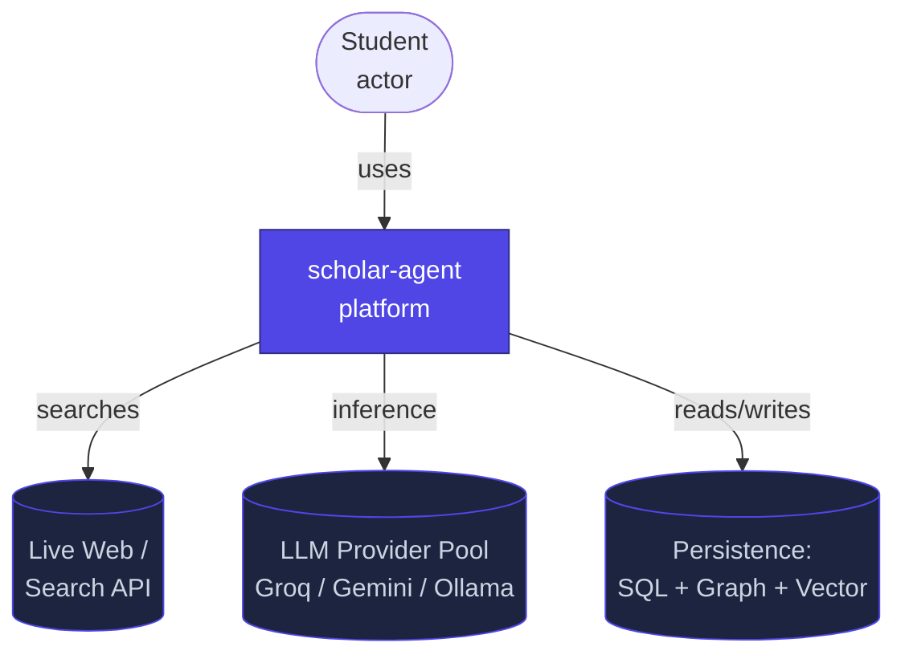
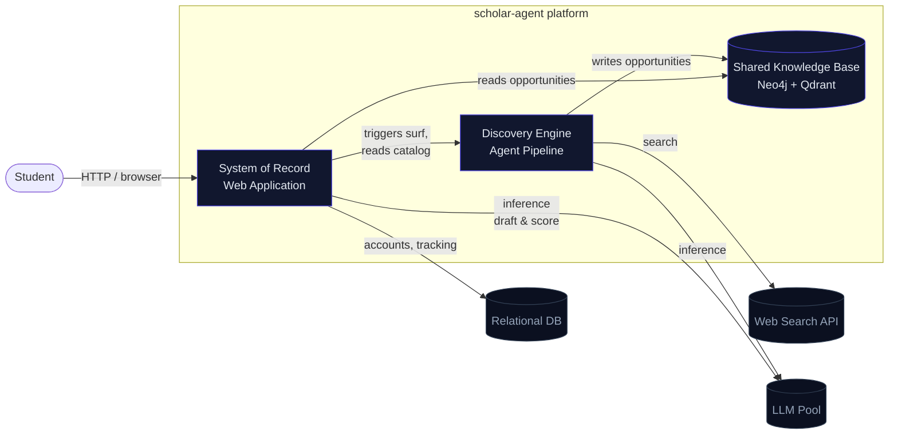
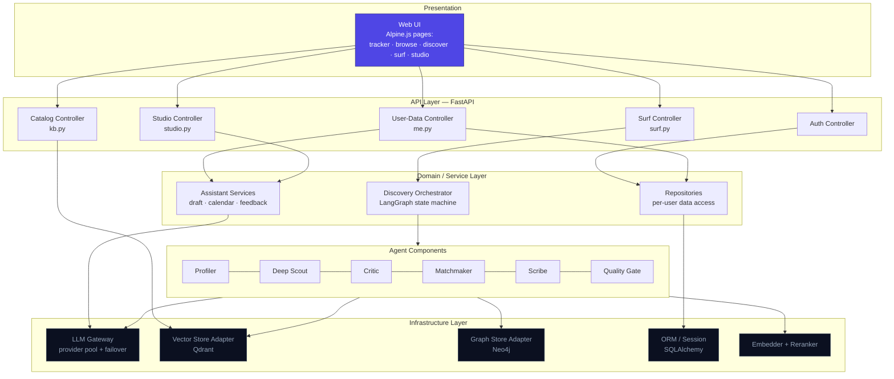
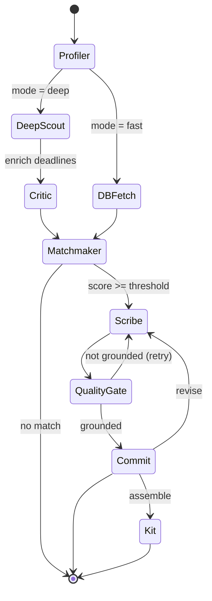
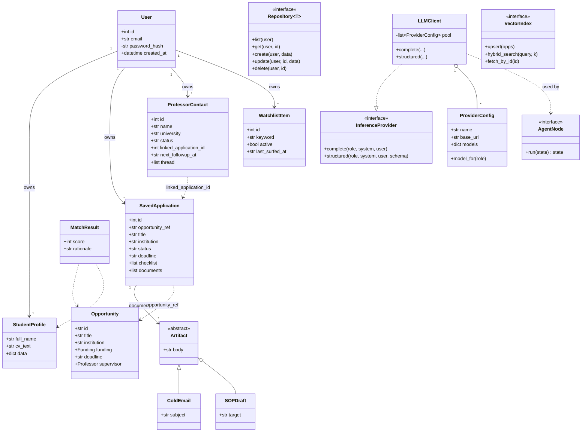
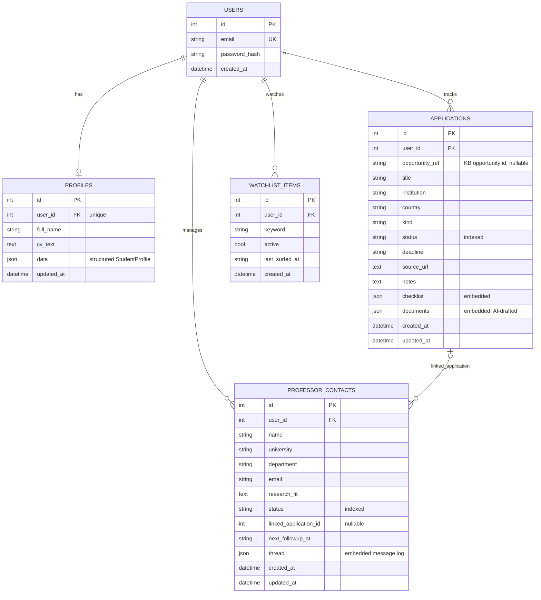
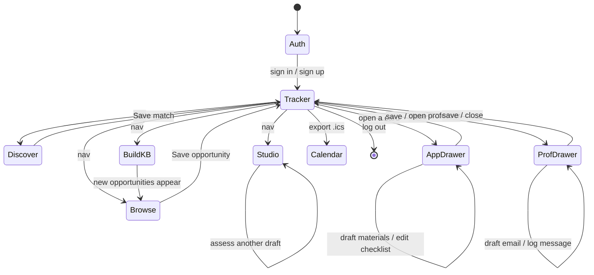

# Software Design Document
## scholar-agent — An Autonomous Scholarship & PhD Application Platform

**Course:** CSE 412 — Software Engineering
**Design methodology:** Roger S. Pressman, *Software Engineering: A Practitioner's Approach* (Ch. 13 — Architectural Design; Ch. 14 — Component-Level Design)
**Document type:** Software Design Document (SDD)

**Team members**

| Name | Student ID |
|------|-----------|
| Md. Tamim Hasan Saykat | 2022-1-60-289 |
| Md. Mahamudur Rahman Maharaz | 2022-3-60-182 |
| Naima Islam | 2022-3-60-215 |

---

## 1. Introduction

### 1.1 Project Overview

scholar-agent is a web platform that helps a student find, track, and complete funded study opportunities (scholarships and PhD positions) from one place. It splits cleanly into two cooperating halves. The first is a **discovery engine** that searches the live web on the student's behalf, extracts structured opportunity records, ranks them against the student's own CV, and drafts grounded application materials. The second is a **system of record** — the web application proper — where the student keeps accounts, tracks each application through its pipeline, manages professor outreach, and practises academic writing.

The two halves are deliberately separated. The discovery engine answers the question *"what opportunities exist in the world?"* and stores its answers in a shared knowledge base (a graph store plus a vector store). The system of record answers *"what is this particular user doing about them?"* and stores its answers in a relational database scoped per user. Keeping these concerns apart is the central architectural decision of the system and recurs throughout this document.

### 1.2 List of Requirements

#### 1.2.1 Functional Requirements

| ID | Requirement |
|----|-------------|
| FR-1 | A visitor can create an account and authenticate; all subsequent data is private to that account. |
| FR-2 | A user can upload or paste a CV; the system extracts a structured student profile from it. |
| FR-3 | The system can search the live web for opportunities from free-text topics and extract structured records (title, institution, funding, deadline, supervisor). |
| FR-4 | Extracted opportunities are persisted to a shared knowledge base and de-duplicated by content identity. |
| FR-5 | A user can browse and filter the knowledge base (by kind, funding status, keyword) and save any opportunity into their personal pipeline. |
| FR-6 | The system ranks opportunities against a user's profile and returns a match score with a rationale. |
| FR-7 | A user can track each saved application through a defined status pipeline and maintain a requirement checklist. |
| FR-8 | For any saved application the system can draft a grounded cold email and a Statement of Purpose, persisted on the record. |
| FR-9 | A user can maintain a professor-outreach record (a lightweight CRM) with a message thread and follow-up dates, and can auto-draft a first-contact email. |
| FR-10 | The system exports all deadlines and follow-ups as an importable calendar (`.ics`). |
| FR-11 | A user can maintain a watchlist of standing interests that the system surfs automatically on a daily schedule. |
| FR-12 | A user can submit writing (IELTS / SOP / academic) and receive criterion-level band scoring with concrete feedback. |

#### 1.2.2 Non-Functional Requirements

| ID | Category | Requirement |
|----|----------|-------------|
| NFR-1 | Security | Passwords are stored only as Argon2 hashes; sessions use signed JWTs; every data query is scoped by `user_id` so no user can read another's rows. |
| NFR-2 | Portability | The system runs with zero external services in development (SQLite, single provider) and scales to Postgres + a multi-provider pool in production without code change. |
| NFR-3 | Resilience | Language-model inference degrades across a provider pool: on rate-limit or outage a call rolls to the next provider, and finally to a local model, so the system survives free-tier limits. |
| NFR-4 | Cost efficiency | Each research pass is bounded (paced request rate, capped page counts, per-role model routing) to fit within free API tiers. |
| NFR-5 | Maintainability | The frontend is build-free (served static assets, CDN libraries); the backend is a typed, layered codebase with an automated test suite. |
| NFR-6 | Extensibility | New model providers, new agent nodes, and new API resources can be added without modifying existing components (see the design-principle discussion in §3.3). |

### 1.3 Technology Stack

| Layer | Technology | Role |
|-------|-----------|------|
| Language | Python 3.12 | Backend and agents |
| Web framework | FastAPI (ASGI) | HTTP API, dependency injection, validation |
| Data validation | Pydantic v2 | Domain schemas + request/response contracts |
| ORM | SQLAlchemy 2.0 | Relational persistence |
| Relational DB | SQLite (dev) / PostgreSQL (prod) | System of record |
| Graph store | Neo4j | Opportunity relationships in the knowledge base |
| Vector store | Qdrant | Semantic search over opportunities |
| Agent orchestration | LangGraph | The discovery state machine |
| Embeddings / reranking | fastembed (BGE + MiniLM cross-encoder) | Local, offline retrieval quality |
| Auth | passlib (Argon2), PyJWT | Password hashing, token signing |
| Frontend | HTML + Alpine.js + Tailwind (CDN) | Build-free reactive UI |
| Model serving | OpenAI-compatible pool: Groq, Gemini, local Ollama | LLM inference with failover |

---

## 2. Architectural Design

This section follows Pressman Ch. 13. We first place the system in its environment with a two-level **architectural context diagram** (§2.1), then present the **top-level component (archetype) view** (§2.2), and finally **instantiate and elaborate each component** (§2.3).

### 2.1 Architectural Context Diagram

The architectural context diagram (ACD) models how the system connects to the entities *outside* its boundary — superordinate systems that use it, subordinate systems it uses, peers, and actors (Pressman §13.3.1).

#### Level 0 — System in context

At Level 0 the whole platform is a single box. The **Student** actor uses it; it depends on three subordinate external systems: the web (searched for opportunities), the cluster of **LLM providers** (used for extraction, matching, writing, and scoring), and a **web-search API**.



#### Level 1 — Internal subsystems in context

At Level 1 we open the platform box into its two subsystems and their shared knowledge base, showing which external entities each subsystem talks to. This makes the discovery/record separation (§1.1) explicit.



**Reading the diagram.** The **System of Record** is the only subsystem the student touches directly. It owns the relational database and reads (never writes) the knowledge base. The **Discovery Engine** is the only writer of the knowledge base; it reaches the outside world (web search, LLM inference) and is invoked *by* the System of Record rather than by the user directly. The knowledge base is the sole shared, decoupling surface between the two.

### 2.2 Top-Level Component Diagram

The macroscopic view decomposes the platform into architectural components (Pressman calls these the application's *archetypes* elaborated into components, §13.4–13.5). Each box below is a package boundary in the actual codebase.



### 2.3 Component Instantiation and Elaboration

Each top-level component is *instantiated* (given a concrete responsibility and interface) and *elaborated* (its internal operation described) below.

**Presentation — Web UI.** A set of static HTML pages driven by Alpine.js. Each page holds a small reactive component (e.g. `trackerApp()`, `browseApp()`, `studioApp()`) that fetches JSON from the API with a bearer token held in browser storage. There is no build step; Tailwind and Alpine load from a CDN. The UI never contains business rules — it renders state and issues requests.

**API Layer — Controllers.** FastAPI routers, one per resource family. `me.py` owns the user's own data (profile, applications, professors, watchlist, calendar, drafting); `kb.py` exposes the read-only opportunity catalog; `surf.py` triggers a discovery pass; `studio.py` scores writing. Every controller depends on a single `CurrentUser` dependency that decodes the JWT and yields the authenticated user — this is the one choke point where identity enters the system, which is what makes per-user isolation enforceable (NFR-1).

**Domain / Service Layer.** Repositories translate controller intent into scoped ORM queries (always filtered by `user_id`). The **Discovery Orchestrator** (`graph_app.py`) compiles the agent state machine and runs it. **Assistant Services** implement the cross-cutting features that combine data with inference: drafting materials for an application, building the calendar, and scoring writing.

**Agent Components.** Six cooperating agents form the discovery pipeline, wired as a directed graph (elaborated in §2.3.1). Each is a pure function over a shared `PipelineState`, calling the LLM Gateway and knowledge-base adapters as needed.

**Infrastructure Layer.** The **LLM Gateway** presents one method surface (`complete`, `structured`) and hides an ordered pool of OpenAI-compatible providers; on failure it fails over to the next and finally to a local model (NFR-3). The **Vector** and **Graph** adapters wrap Qdrant and Neo4j. The **Embedder/Reranker** produces vectors and re-scores candidates locally so retrieval quality does not depend on a paid API. The **ORM/Session** component manages SQLAlchemy sessions and the additive auto-migration that keeps the schema current.

#### 2.3.1 Elaboration of the Discovery Orchestrator (agent state machine)

The orchestrator is the most behaviour-rich component, so we elaborate its control flow explicitly. It is a LangGraph `StateGraph` over a shared `PipelineState`, with two entry paths (a *deep* web search and a *fast* database lookup) that converge at matching, then a Scribe⇄Quality-Gate refinement loop.



**Reading the machine.** The **Profiler** turns a CV into a structured `StudentProfile` and routes the run. The **Deep Scout** searches the web and extracts `Opportunity` records; the **Critic** fills missing deadlines. The **Matchmaker** scores each opportunity against the profile and gates on a threshold. The **Scribe** drafts materials; the **Quality Gate** verifies every claim is grounded in source text and loops back to the Scribe until it passes. This bounded feedback loop is what produces trustworthy, non-hallucinated output.

---

## 3. Component-Level Design

This section follows Pressman Ch. 14. We first execute the three elaboration steps for identifying design classes (§3.1), then present the class diagram derived from them (§3.2), state how the class-based design principles were applied (§3.3), and finally give the database design (§3.4).

### 3.1 Elaboration of Design Components

Pressman's component-level design begins by refining analysis classes into *design classes* across two domains, then defining interfaces. We document each step below.

#### Step 1 — Design classes in the problem (business) domain

These classes model the vocabulary of the scholarship-hunting problem itself. They are technology-independent — they would exist regardless of database or framework.

| Design class | Responsibility |
|--------------|----------------|
| `User` | An account holder; the identity that owns all other records. |
| `StudentProfile` | Structured representation of the applicant (education, skills, interests) derived from a CV. |
| `Opportunity` | A funded position or scholarship: title, institution, funding, deadline, supervisor. |
| `SavedApplication` | A user's tracking record for one opportunity: status, checklist, drafted documents. |
| `ProfessorContact` | An outreach target with a message thread and follow-up schedule. |
| `WatchlistItem` | A standing search interest surfed automatically. |
| `MatchResult` | The score and rationale relating a `StudentProfile` to an `Opportunity`. |
| `Artifact` (`ColdEmail`, `SOPDraft`) | A generated application document. |
| `WritingFeedback` | Criterion-level band scoring of a piece of writing. |

#### Step 2 — Design classes in the infrastructure domain

These classes provide the technical services the problem-domain classes need (persistence, network, UI mediation, inference). They correspond to Pressman's infrastructure domain.

| Design class | Domain | Responsibility |
|--------------|--------|----------------|
| `UserRepository`, `ApplicationRepository`, `ProfessorRepository`, `WatchlistRepository` | Persistence | Scoped CRUD over relational rows, always filtered by `user_id`. |
| `Session` (SQLAlchemy) | Persistence | Unit-of-work / transaction boundary. |
| `VectorStore` (Qdrant adapter) | Persistence | Upsert and semantic/hybrid search over opportunities. |
| `GraphStore` (Neo4j adapter) | Persistence | Relationship storage and freshness pruning. |
| `Embedder` / `Reranker` | Compute | Local vector generation and candidate re-scoring. |
| `LLMClient` (Gateway) | Network | Provider-agnostic inference with failover. |
| `ProviderConfig` | Network | One endpoint's URL, key, and per-role model map. |
| `AuthService` | Security | Password hashing (Argon2) and JWT issue/verify. |
| `CurrentUser` (DI dependency) | UI mediation | Resolves the authenticated user for each request. |

#### Step 3b — Interfaces for each component

Pressman's Step 3b identifies the interfaces (message sets) each component exposes. We define them as abstract contracts, which is what enables the substitution and inversion described in §3.3.

| Interface | Operations | Realised by |
|-----------|-----------|-------------|
| `InferenceProvider` | `complete(role, system, user)`, `structured(role, system, user, schema)` | `LLMClient` over any `ProviderConfig` |
| `Repository<T>` | `list(user)`, `get(user, id)`, `create(user, data)`, `update(user, id, data)`, `delete(user, id)` | Each concrete repository |
| `VectorIndex` | `upsert(opps)`, `hybrid_search(query, k)`, `scroll_all(limit)`, `fetch_by_id(id)` | Qdrant adapter |
| `AgentNode` | `run(state) -> state` | Each of the six agents |
| `Assistant` | `draft_application(app)`, `draft_email(prof)`, `build_calendar(user)`, `score_writing(text)` | Assistant services |

### 3.2 Class Diagram

The class diagram below is derived directly from the Step 1 and Step 2 tables. Problem-domain classes are shown with their key attributes; infrastructure classes are shown as the services they realise, connected through the interfaces of Step 3b.



### 3.3 Application of Pressman's Design Principles for Class-Based Components

Pressman (Ch. 14, "Designing Class-Based Components") prescribes the four SOLID principles. Each is applied concretely in this design as follows.

**Open–Closed Principle (OCP).** The `InferenceProvider` interface lets the system add new model back-ends without modifying any caller. The provider pool is data-driven (`providers.json`): adding Cerebras or a new local model is a configuration entry, not a code change. Likewise the agent pipeline is *open for extension* — a new `AgentNode` is registered on the `StateGraph` — while the existing nodes are *closed for modification*. New API resources are added as new routers mounted on the app, never by editing existing controllers.

**Liskov Substitution Principle (LSP).** Every `ProviderConfig` in the pool is substitutable for every other behind `InferenceProvider`: the gateway's failover loop swaps a rate-limited Groq provider for Gemini, and finally for local Ollama, with no change in the contract the agents observe. The `Artifact` hierarchy is substitutable too — `ColdEmail` and `SOPDraft` are used wherever an `Artifact` is expected (e.g. when persisting into an application's `documents` list). No subtype strengthens a precondition or weakens a postcondition.

**Dependency Inversion Principle (DIP).** High-level policy does not depend on low-level detail; both depend on abstractions. The agents (high-level policy) depend on the `InferenceProvider` and `VectorIndex` *interfaces*, not on Groq's SDK or Qdrant's client directly. Controllers depend on repository interfaces, not on SQLAlchemy internals. Concrete implementations are injected — the LLM gateway and the database session are provided through FastAPI's dependency-injection mechanism and the cached factory functions — so the direction of source-code dependency points toward abstractions.

**Interface Segregation Principle (ISP).** Interfaces are narrow and role-specific rather than fat. `InferenceProvider` exposes only `complete`/`structured`; the `VectorIndex` exposes only retrieval operations; each `Repository` exposes only the five CRUD operations its resource needs. A client that only reads the catalog depends on `VectorIndex` and is not forced to know about the relational repositories. The controllers are similarly segregated by resource family (`me`, `kb`, `surf`, `studio`) so that no controller carries operations irrelevant to its clients.

### 3.4 Database Design

The relational schema is the System of Record. Every user-owned table carries a `user_id` foreign key to `users`, with cascade delete, so a per-user data-isolation guarantee is structural rather than incidental (NFR-1). Bounded, per-record collections (a checklist, a message thread, drafted documents) are stored as embedded JSON columns rather than separate tables — they are small, always fetched with their parent, and never queried independently, so a child table would add joins without benefit.

#### 3.4.1 Entity–Relationship Diagram



#### 3.4.2 Table Schemas

**`users`** — the identity root.

| Column | Type | Key / Constraint | Notes |
|--------|------|------------------|-------|
| `id` | INTEGER | PK | Surrogate identity. |
| `email` | VARCHAR(320) | UNIQUE, INDEX | Login handle. |
| `password_hash` | VARCHAR(255) | NOT NULL | Argon2 hash only; never the password. |
| `created_at` | TIMESTAMP | NOT NULL | Account creation. |

**`profiles`** — one-to-one with a user.

| Column | Type | Key / Constraint | Notes |
|--------|------|------------------|-------|
| `id` | INTEGER | PK | |
| `user_id` | INTEGER | FK→users, UNIQUE, ON DELETE CASCADE | Enforces one profile per user. |
| `full_name` | VARCHAR(200) | | |
| `cv_text` | TEXT | | Raw CV text. |
| `data` | JSON | | Structured `StudentProfile` (Profiler output). |
| `updated_at` | TIMESTAMP | ON UPDATE | |

**`applications`** — the pipeline cards.

| Column | Type | Key / Constraint | Notes |
|--------|------|------------------|-------|
| `id` | INTEGER | PK | |
| `user_id` | INTEGER | FK→users, INDEX, CASCADE | Owner. |
| `opportunity_ref` | VARCHAR(32) | nullable | Content id of a KB `Opportunity`, or null if entered manually. |
| `title` | VARCHAR(500) | NOT NULL | |
| `institution` / `country` | VARCHAR | nullable | |
| `kind` | VARCHAR(40) | default `scholarship` | |
| `status` | VARCHAR(40) | INDEX, default `interested` | One of the seven pipeline stages. |
| `deadline` | VARCHAR(32) | nullable | ISO date. |
| `source_url` | TEXT | nullable | |
| `notes` | TEXT | | |
| `checklist` | JSON | | `[{label, done}]`. |
| `documents` | JSON | | `[{type, title, body, created_at}]`; server-generated. |
| `created_at` / `updated_at` | TIMESTAMP | | |

**`professor_contacts`** — the outreach CRM.

| Column | Type | Key / Constraint | Notes |
|--------|------|------------------|-------|
| `id` | INTEGER | PK | |
| `user_id` | INTEGER | FK→users, INDEX, CASCADE | Owner. |
| `name` | VARCHAR(200) | NOT NULL | |
| `university` / `department` / `email` | VARCHAR | nullable | |
| `research_fit` | TEXT | | Why this professor matches the user. |
| `status` | VARCHAR(40) | INDEX, default `to_contact` | One of six outreach stages. |
| `linked_application_id` | INTEGER | nullable | Soft link to an `applications` row. |
| `next_followup_at` | VARCHAR(32) | nullable | Feeds the calendar export. |
| `thread` | JSON | | `[{direction, subject, body, at}]`. |
| `created_at` / `updated_at` | TIMESTAMP | | |

**`watchlist_items`** — standing interests for the daily surf.

| Column | Type | Key / Constraint | Notes |
|--------|------|------------------|-------|
| `id` | INTEGER | PK | |
| `user_id` | INTEGER | FK→users, INDEX, CASCADE | Owner. |
| `keyword` | VARCHAR(300) | NOT NULL | Search topic. |
| `active` | BOOLEAN | default true | |
| `last_surfed_at` | VARCHAR(32) | nullable | Drives oldest-first rotation. |
| `created_at` | TIMESTAMP | | |

#### 3.4.3 Relationship Mappings

- **users → profiles**: one-to-one (a `UNIQUE` constraint on `profiles.user_id`), cascade delete.
- **users → applications / professor_contacts / watchlist_items**: one-to-many, cascade delete — removing an account removes all its data (satisfying data-ownership and deletion requirements).
- **applications ⇢ professor_contacts**: an optional many-to-one soft link (`linked_application_id`), not a hard foreign key, so outreach can exist before or independently of a tracked application.
- **applications ⇢ knowledge base**: a *cross-store* reference by content id (`opportunity_ref`), deliberately not a foreign key — it points into Neo4j/Qdrant, preserving the discovery/record decoupling of §1.1.

The knowledge-base entities (`Opportunity`, its `Funding` and `Professor` value objects) live in the graph and vector stores, not in the relational schema, and are therefore outside the relational ER model above by design.

---

## 4. User Interface Design

### 4.1 UI Wireframes / Mockups

The interface is a small set of single-purpose pages sharing one visual language (a dark, glass-panel theme with a consistent top navigation). Each layout is described below in enough detail to reproduce in Figma.

#### 4.1.1 Application Tracker (home)

```
┌──────────────────────────────────────────────────────────────┐
│  🎓 scholar·agent   [Tracker] Browse Discover BuildKB Studio  │  ← header: brand left,
│                                    📅 Calendar  user@mail  ⎋   │    nav center, actions right
├──────────────────────────────────────────────────────────────┤
│  MY APPLICATIONS                              [+ Add manually] │
│  ┌────────────┬────────────┬────────────┬────────────┐        │  ← Kanban-style columns
│  │ Interested │ Preparing  │ Applied    │ Interview… │        │    one per pipeline status
│  ├────────────┼────────────┼────────────┼────────────┤        │
│  │ ▢ DAAD PhD │ ▢ Erasmus  │ ▢ Chevening│            │        │  ← cards: title, institution,
│  │   TU Munich│   ⏳ Nov 1  │            │            │        │    deadline chip; drag between
│  │   ⏳ soon    │            │            │            │        │    columns to change status
│  └────────────┴────────────┴────────────┴────────────┘        │
└──────────────────────────────────────────────────────────────┘

  Detail drawer (slides in from right when a card is clicked):
  ┌───────────────────────────────┐
  │ DAAD PhD — TU Munich        ✕ │
  │ Status ▼   Deadline [ 2026… ] │
  │ ── Checklist ──               │
  │  ☑ CV   ☐ SOP   ☐ IELTS       │
  │ ── Materials ──   [✍️ Draft]  │  ← generates + persists cold email + SOP
  │  ▸ PhD inquiry (Email)        │    each item expands to show body, Copy / Download
  │  ▸ Statement of Purpose (SOP) │
  │ Notes […………]                  │
  │       [Save changes] [Cancel] │
  └───────────────────────────────┘
```

#### 4.1.2 Browse (opportunity catalog)

```
┌──────────────────────────────────────────────────────────────┐
│  📚 Browse opportunities            [nav …]                    │
├──────────────────────────────────────────────────────────────┤
│  [ 🔎 search title / university…      ]                        │  ← filter bar
│  (Scholarships)(PhD)(Fellowship)   [💰 Fully funded]           │    kind chips + funded toggle
│  42 of 128 opportunities · sorted by soonest deadline    ↻     │
├──────────────────────────────────────────────────────────────┤
│  ┌───────────┐ ┌───────────┐ ┌───────────┐                    │  ← responsive card grid
│  │ Title     │ │ Title     │ │ Title     │                    │    (3-col desktop, 1-col mobile)
│  │ University│ │ University│ │ University│                    │
│  │ desc…     │ │ desc…     │ │ desc…     │                    │
│  │ 💰 ⏳Nov1  │ │ ⏳Dec15    │ │ 💰        │                    │
│  │ 🔗source  +Save│ …       │ │ ✓In pipe. │                    │  ← Save moves it into the tracker
│  └───────────┘ └───────────┘ └───────────┘                    │
└──────────────────────────────────────────────────────────────┘
```

#### 4.1.3 Writing Studio

```
┌──────────────────────────────────────────────────────────────┐
│  🎯 Writing Studio                  [nav …]                    │
├───────────────────────────────┬──────────────────────────────┤
│  1 · Mode                     │   (feedback panel)            │
│  [IELTS T2][IELTS T1][SOP][Ac]│   ┌────────────────────────┐  │
│  2 · Task prompt              │   │  ◐ 6.5  Overall band    │  │  ← left: input; right: results
│  [……………………………]                │   │  Task 6.0  Coherence…  │  │
│  3 · Your writing   142 words │   │  ✓ strengths           │  │
│  [………………………………………………]          │   │  ▲ focus next          │  │
│  [………………………………………………]          │   │  ✍️ sentence upgrades   │  │
│         [🎯 Assess my writing]│   └────────────────────────┘  │
└───────────────────────────────┴──────────────────────────────┘
```

The **Surf / Build-KB** and **Discover** pages follow the same shell: a single input region (topics textarea or CV upload), a primary action button with a busy state, and a live progress list.

### 4.2 Navigation Flow

The user moves through a small, mostly flat state space anchored on the tracker. The diagram below shows the navigable states and the transitions between them.



**Reading the flow.** Authentication is the single entry gate; every other screen requires a valid session and redirects to `Auth` if the token is missing. The **Tracker** is the hub — all four feature pages hang off it and most flows return to it (saving an opportunity from Browse or Discover, closing a drawer). The drawers (`AppDrawer`, `ProfDrawer`) are in-place sub-states of the tracker, not separate pages, matching the slide-in panels of §4.1.1. This keeps the mental model shallow: the student is almost always "on the tracker," briefly stepping out to find, draft, or practise.

---

*End of Software Design Document.*
